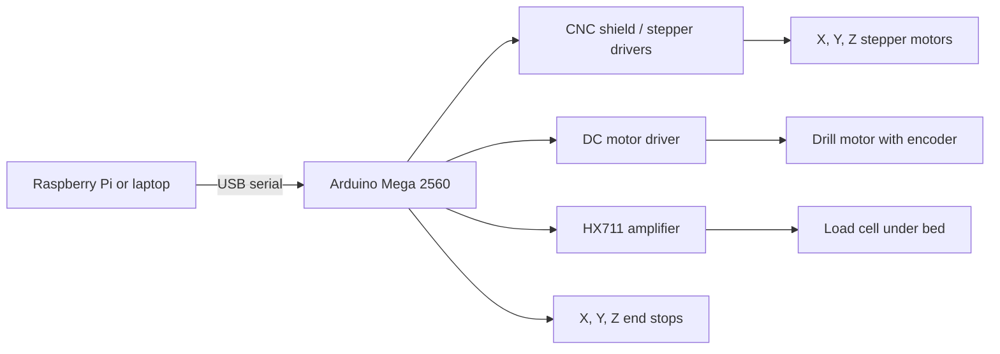

# Robo-Recycle

Robo-Recycle is an automated screw-removal system for hard drive disassembly. The current build uses a repurposed Ultimaker gantry, an Arduino Mega 2560 for real-time motor control, and a Raspberry Pi or laptop as a serial-command host.

This documentation refresh was written for new students on 2026-04-14 using:

- the code in this repository
- the archived handover deck `RoboRecycle_Handover  -  Repaired.pptx`
- the archived report `Robo-Recycle 2025 Report.docx`

## Start Here

If you are new to this project, read these in order:

1. [Getting started](docs/GETTING_STARTED.md)
2. [Components and wiring](docs/COMPONENTS_AND_WIRING.md)
3. [Codebase guide](docs/CODEBASE_GUIDE.md)

Reference material:

- [Legacy README snapshot](docs/README_LEGACY_2026-04-14.md)

## What This Project Currently Does

- Homes a 3-axis gantry with end stops
- Moves the tool head to absolute X/Y/Z positions
- Rotates a DC drill motor by a requested number of degrees using encoder feedback
- Reads a load cell under the workpiece
- Runs an `UNSCREW` routine at a hard-coded or user-provided XY position

## High-Level Architecture

## Quick Start

1. Open [docs/GETTING_STARTED.md](docs/GETTING_STARTED.md).
2. Install the required Arduino libraries. The main firmware depends on `HX711` and `MultiStepperLite`, which are referenced by the code but not bundled in this repo.
3. Open `System Integration/main/main.ino` in Arduino IDE and upload it to the Arduino Mega 2560.
4. Open a serial monitor at `115200` baud and run `HELP`, `HOME`, `LOAD`, and `GOTO`.
5. Do not run `UNSCREW` until you have checked end stops, motor direction, and load-cell readings on your own hardware.

## Current Status

This is a partially working lab prototype, not a polished turnkey system.

Known limitations:

- `UNSCREWCHAIN` currently ignores user-supplied coordinates and still uses the built-in `hardCodePoints[]` array.
- The load-cell thresholds in `main.ino` are installation-specific and need to be re-measured on each real setup.
- The screw-retention approach is magnetic, so it may not hold non-magnetic screws.
- Several files in `Test files/` are older experiments and use different baud rates and command formats from the main system.

## Main Entry Points

- `System Integration/main/main.ino`: main Arduino firmware
- `System Integration/Unscrew.py`: simple Python script that sends repeated `UNSCREW` commands
- `Test files/`: older experiments for end stops, force testing, homing, and serial control

## Recommended Reading Order In The Code

1. `System Integration/main/main.ino`
2. `System Integration/main/STEPPERmotor.cpp`
3. `System Integration/main/DCmotor.cpp`
4. `System Integration/main/Encoder.cpp`
5. `System Integration/main/Loadcell.cpp`
